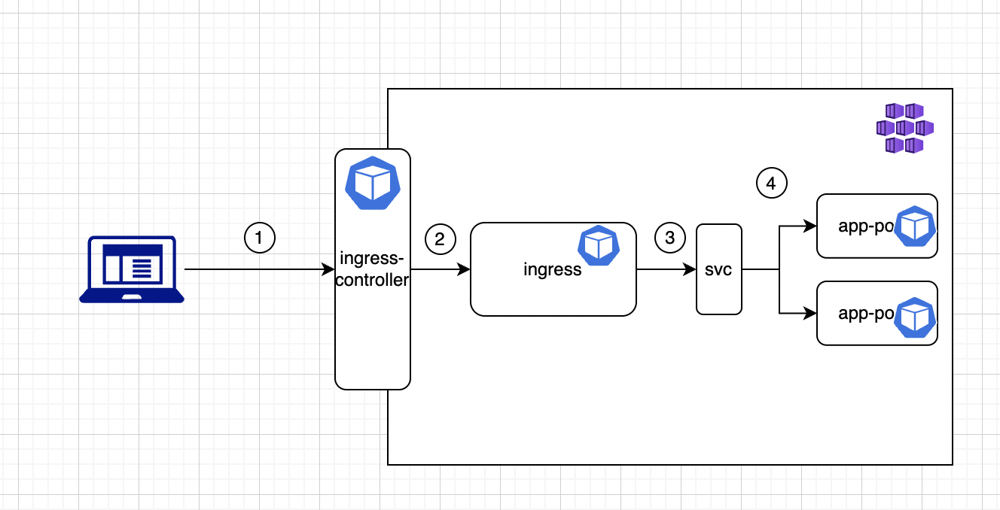
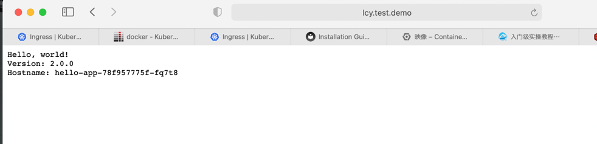

## Ingress-learning
This directory is created by the purpose of learning&test for the usage of ingress/ingress controller

Goal 
1. Create nginx ingress controller.
2. Create Helloworld application with ingress.
3. Expose HelloWorld application to internet

Overview.

### Step1
User can not access directly to the pods resources in k8s.
So user need to access the ingress-controller first to access the app inside aks.
Details check in directory nginx.

To install official nginx controller(ngnix)
Visit: https://kubernetes.github.io/ingress-nginx/deploy/


```shell
kubectl apply -f https://raw.githubusercontent.com/kubernetes/ingress-nginx/controller-v1.2.0/deploy/static/provider/cloud/deploy.yaml
```
then you check with you pods with 
```shell
kubectl get pods --namespace=ingress-nginx
# ingress-nginx-controller-5849c9f946-46rpr   1/1     Running     0          2m7s

```

Here, we completed our first step in the overview.
```shell
ingress-nginx   ingress-nginx-controller             LoadBalancer   10.0.140.220   <external IP>   80:30939/TCP,443:30690/TCP   4m6s
```
We have an ingress-nginx-controller act as a load balancer.

Once you have the external IP address (or FQDN), set up a DNS record pointing to it. 

I do not habe a DNS server and I don't have any plan to reigister one, so I will just add dns resolver in my local.
```shell
sudo vim /etc/hosts
# add your prefer dns record and map to the external IP of your ingress controller
#E.g. <lcy.test.local> <external IP>
```
Since then Step 1 is finished. 
You can try to curl you external IP and get 404. this is because we don't have any backend for it.

### Step2 Deploy a demo app
Check the hello-world directory. it has a Deployment.yaml in it
```shell
kubectl apply -f Deployemnt.yaml
# check if it succeed
kubectl get pods -n dev
# NAME                         READY   STATUS    RESTARTS   AGE
# hello-app-78f957775f-fq7t8   1/1     Running   0          6m29s
# hello-app-78f957775f-wqf7s   1/1     Running   0          6m29s
```
Then you are finishing the step 4 in the overview.
You already two pods for hello-app

### Step 3 Group your pods via service
Please kindly check the Service.yaml file in the Hello-app folder
You can group your pods via a service by selector app:hello

```yaml
labels:
  app: hello
```
code block in your deployment

```shell
kubectl apply -f Service.yaml 
# service/hello-service created

# Check whether your svc is deployed.
kubectl get svc -n dev
# NAME            TYPE        CLUSTER-IP     EXTERNAL-IP   PORT(S)   AGE
# hello-service   ClusterIP   10.0.119.125   <none>        80/TCP    19s
```

Notice you do not have a external Ip for your service. Will config at next step
Since nowm you have your svc in the overview.

### Deploy ingress
We need to create an ingress object for our demo-app. To let the traffic from our ingress-controller to access the app
Please kindly check the Ingress.yaml under Hello-app folder

```shell
kubectl apply -f ingress.yaml 
# ingress.networking.k8s.io/demo-ingress created
kubectl get ing -n dev
# NAME           CLASS   HOSTS           ADDRESS                PORTS   AGE
# demo-ingress   nginx   lcy.test.demo   <your address>        80      31s
```
The ingress connect with service via backend
```yaml
backend:
  service:
    name: hello-service
```

This label is the metadate of your service
```yaml
metadata:
  name: hello-service
```

From now you already have the ingress in the overview and connnected.
Then try to access lcy.test.demo/ in your browser


See, since then you can access you demo-app via url


